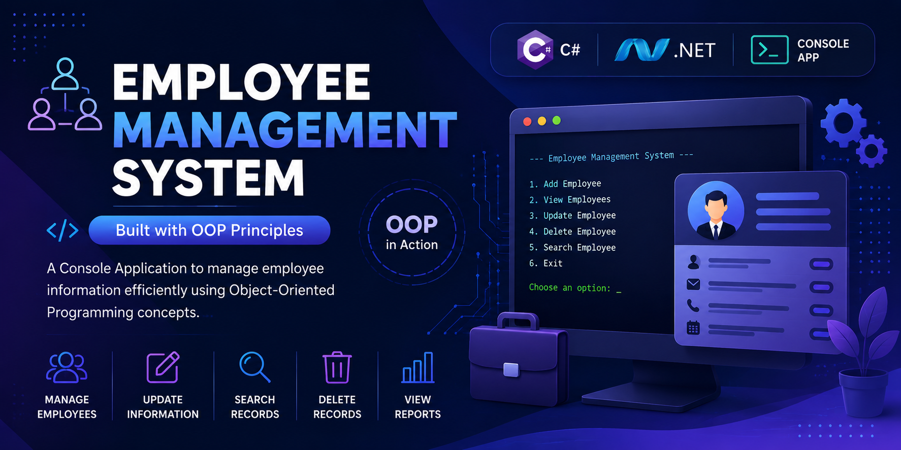

<p align="center">
  
</p>


# 👨‍💼 Employee Management System (OOP)


A simple **C# Console Application** demonstrating the core principles of **Object-Oriented Programming (OOP)** through a real-world employee management system.

---

# 📑 Table of Contents

- Overview
- Features
- OOP Concepts
- Project Structure
- Application Preview
- Example Output
- Technologies
- Learning Outcomes
- Project Goals
- Future Improvements
- Author

---

# 📌 Overview

This project simulates an employee management system where different employee types inherit from a common base class.

It demonstrates how **Object-Oriented Programming (OOP)** principles can be applied to build reusable, maintainable, and scalable applications using C#.

---

# 🚀 Features

- 👨‍💼 Employee Management
- 👨‍💻 Developer Employee Type
- 🎨 Designer Employee Type
- 🔒 Encapsulation using Properties
- 🧬 Inheritance between Classes
- 🔄 Method Overriding
- 🎯 Runtime Polymorphism
- 📋 Employee Information Display

---

# 🏗️ OOP Concepts Implemented

## 🔒 Encapsulation

- Private fields
- Properties
- Data validation

## 🧬 Inheritance

- Employee (Base Class)
- Developer
- Designer

## 🔄 Polymorphism

- Method Overriding
- Runtime Polymorphism

## 🏛️ Abstraction

- Shared employee behaviors
- Reusable class structure

---
## ✨ Key Concepts Demonstrated

- Object-Oriented Programming (OOP)
- Classes & Objects
- Encapsulation
- Inheritance
- Polymorphism
- Method Overriding
- Code Reusability
- Clean Class Design
---

# 📂 Project Structure

```text
EmployeeManagementSystem
│
├── Employee.cs
├── Developer.cs
├── Designer.cs
└── Program.cs
```

---

# 📸 Application Preview

> Console Output


---

# 📊 Example Output

```text
ID: 101
Name: Anoud
Department: IT
Salary: 1200

Developer is writing code

----------------------------

ID: 202
Name: Malaak
Department: Design
Salary: 700

Designer is creating UI designs
```

---

# 🎯 Highlights

- ✅ Object-Oriented Programming
- ✅ Clean Class Design
- ✅ Encapsulation
- ✅ Inheritance
- ✅ Polymorphism
- ✅ Console Application

---

# 🛠️ Technologies

| Technology | Purpose |
|------------|---------|
| C# | Programming Language |
| .NET | Framework |
| OOP | Software Design |
| Console | User Interface |

---

## 🎯 Skills Demonstrated

- Problem Solving
- OOP Design
- C# Programming
- Clean Code
- Console Application Development

---

# 🚀 Future Improvements

- Employee Database Integration
- Entity Framework Core
- SQL Server
- CRUD Operations
- Windows Forms Version
- ASP.NET Core Web API
- Authentication & Authorization

---

# 👩‍💻 Author

**Anoud Alsaidi**

Backend Developer | .NET Developer | C# | SQL Server

- GitHub: https://github.com/Anoudalsaidi
- LinkedIn: https://www.linkedin.com/in/anoud-alsaidi

---

⭐ If you found this project helpful, consider giving it a Star.
